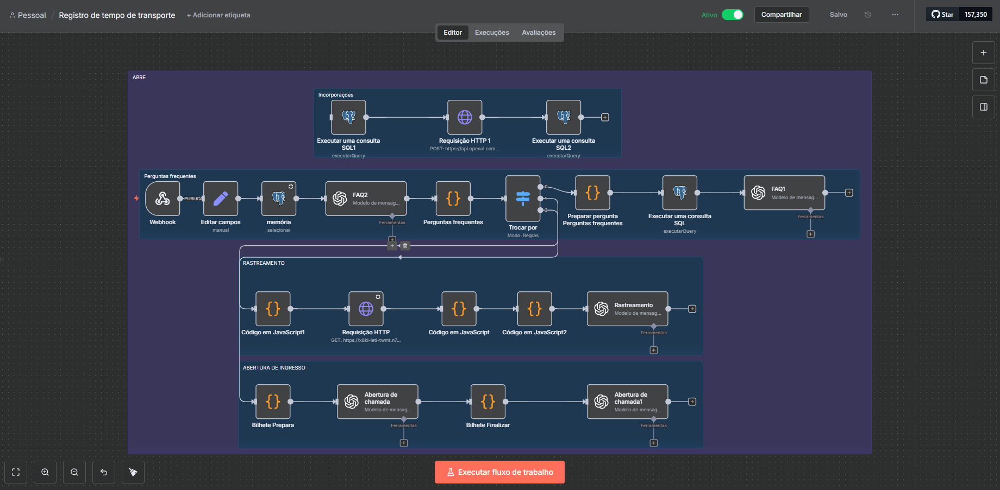

# 🤖 Assistente Inteligente da RápidoLog  
### Fluxo completo de atendimento automatizado usando IA, embeddings, n8n e integrações avançadas



---

## 📌 Visão Geral  
O **Assistente Inteligente da RápidoLog** é um sistema completo de atendimento automatizado criado para proporcionar respostas rápidas, humanizadas e inteligentes, integrando:

- **IA (OpenAI GPT-4.1 Mini)**  
- **RAG com Embeddings (vectores SQL)**  
- **Orquestração no n8n**  
- **Automação de rastreamento de encomendas**  
- **Abertura guiada de tickets com coleta dinâmica de informações**  
- **Fluxo de decisões baseado em regras e fallback inteligente**

O projeto foi desenvolvido como parte de um desafio técnico, demonstrando domínio em automações avançadas, IA aplicada e boas práticas de arquitetura.

---

## 👨‍💻 Autor
**Giovanni Gomes Neves**  
Desenvolvedor Full Stack especializado em automações com IA e n8n.  
Focado em soluções de fluxo inteligente, integrações e atendimento automatizado de alta qualidade.

---

# 🧠 Arquitetura Geral do Sistema

### 🔹 Módulo 1 — FAQ Inteligente (RAG com Embeddings)
- Os documentos são divididos em *chunks* e armazenados em `public.chunks`.
- Cada trecho recebe uma incorporação usando o modelo `text-embedding-3-small`.  
- A busca é vetorial, retornando o trecho mais relevante.
- O modelo GPT responde usando **somente** o conteúdo encontrado.
- Regras aplicadas:
  - máximo de 3 frases  
  - tom carismático  
  - não inventa informações  
  - fallback inteligente quando não houver resposta clara  

---

### 🔹 Módulo 2 — Rastreamento Inteligente
- Cliente envia o código de rastreio.  
- O fluxo n8n consulta uma API logística realista.  
- O JavaScript do fluxo normaliza o JSON retornado.  
- A IA gera uma resposta **humanizada**, com:
  - status  
  - última movimentação  
  - previsão  
  - explicação contextual  
- Caso o pedido esteja atrasado → abre a possibilidade de gerar um chamado.

---

### 🔹 Módulo 3 — Abertura Guiada de Tickets (Entrevista Automatizada)
A assistente virtual **Bia** conduz uma coleta orientada, pergunta por pergunta:

Etapas:
1. Nome completo  
2. Telefone com DDD  
3. Código de rastreamento  
4. Tipo do problema  
5. Descrição  
6. Confirmação final  
7. Geração automática do ticket  

A lógica interna garante que o modelo sempre responda no formato:

```json
{
  "ticket": {
    "nome": "",
    "telefone": "",
    "codigo_rastreio": "",
    "tipo_problema": "",
    "descricao": ""
  },
  "proxima_etapa": "",
  "modelo_respondeu": ""
}

| Tecnologia                          | Uso                                       |
| ----------------------------------- | ----------------------------------------- |
| **OpenAI GPT-4.1 Mini**             | Respostas, geração de mensagens, fallback |
| **OpenAI Embeddings**               | RAG para FAQ                              |
| **Supabase (PostgreSQL + Vetores)** | Armazenamento vetorial dos embeddings     |
| **n8n**                             | Orquestração completa dos fluxos          |
| **JavaScript interno (n8n)**        | Normalização de dados e regras            |
| **API externa de rastreamento**     | Dados logísticos realistas                |
📦 rapido-log-assistant
 ┣ 📄 README.md
 ┣ 📄 LICENÇA
 ┣ 📄 RápidoLog Transportadora.json     # Fluxo completo n8n exportado
 ┣ 📄 diagrama-flow-n8n.png             # Diagrama principal
 ┗ 📄 arquitetura-projeto.png           # Arquitetura complementar
